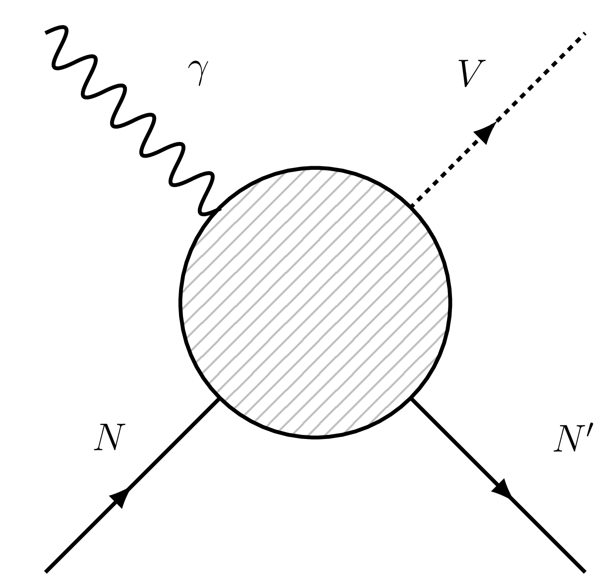

# vector_photoproduction
Framework for building amplitudes involving vector meson production via quasi-elastic scattering of a real photon on a nucleon target.

<p align="center">
  
</p>

Such processes are of interest at many experiments at JLab and the future EIC.
## EXECUTABLES
Requires [ROOT](https://root.cern.ch/) (tested with version 6.17) with [*MathMore*](https://root.cern.ch/mathmore-library) libraries installed.

To build any example script in the `executables` folder, for example `test.cpp`, use:

```bash
mkdir build
cd build
cmake ..
make test
````

#### [polarized_pentaquark](./executables/polarized_pentaquark.cpp)
Sensitivity study of double polarized observables to the LHCb pentaquarks in Hall A at JLab.
Reproduces the results in [2]. See [JPAC page on γp→J/ψp](http://cgl.soic.indiana.edu/jpac/polarizedPenta.php).

#### [psi_comparison](./executables/psi_comparison.cpp)
Comparison of the unpolarized cross sections for the photoproduction of the Psi(1S) and Psi(2S) states near threshold in the GlueX kinematics.

Optional command line flags are:
```bash
-c [0:180]    # CM scattering angle in degrees (default: 0)  
-lab          # Toggle plotting with lab photon energy on x-axis (default: false)
```
Outputs PSI(2S) unpolarized cross-section and ratio of (2S)/(1S) plotted in pdfs.

#### [chi_c1_photoproduction](./executables/chi_c1_photoproduction.cpp)
Analytical model for the unpolarized cross section near threshold of axial vector states. Decomposed into different exchanges in the t-channel (e.g. omega, rho, phi).

Optional command line flags are:
```bash
-c [0:180]    # CM scattering angle in degrees (default: 0)
-f [string]   # Desired filename of output (default: chi_c1_photoproduction.pdf)
-integ        # Toggle integrated xsection instead of differential
-feyn         # Toggle evaluating amplitude with covariant rules (included for debugging)
```
Outputs the differential (or integrated) cross-section to a pdf.

#### [X3872_photoproduction](./executables/X3872_photoproduction.cpp)
Prediction for the unpolarized cross-section for exclusive X(3872) photoproduction at low momentum transfer and high energies of interest for the future EIC.

Optional command line flags are:
```bash
-c [0:180]    # CM scattering angle in degrees (default: 0)
-n [int]      # Number of points to plot with (default: 100)
-f [string]   # Desired filename of output (default: X3872_photoproduction.pdf)
-integ        # Toggle integrated xsection instead of differential
```

## AMPLITUDES
The main object of interest is the abstract [`amplitude`](./include/amplitudes/amplitude.hpp) class. This allows you to build observables from helicity amplitudes:

* Differential cross section ( dσ / dt )
* Integrated total cross section ( σ )
* Polarization asymmetries ( A_LL and K_LL )

Available amplitudes, so far, are those considered in [1,2]:

* [Single baryon resonance](./include/amplitudes/baryon_resonance.hpp) (s-channel)
* [Pomeron exchange amplitude](./include/amplitudes/pomeron_exchange.hpp) (t-channel)
* [Fixed-spin vector meson exchange](./include/amplitudes/vector_exchange.hpp) (t-channel)
* [Reggeized meson exchange](./include/amplitudes/reggeized_meson.hpp) (t-channel)

Incoherent (interfering) sums of amplitudes may be constructed through the [`amplitude_sum`](./include/amplitudes/amplitude_sum.hpp) class.

## PLOTTING
Plots are automatically created using the JPAC collaboration style guidelines. For more information see the [jpacStyle](https://github.com/dwinney/jpacStyle) library.

<p align="center">
  
</p>

## REFERENCES
* [1] "Theoretical model of the phi meson photoproduction amplitudes" Lesniak and Szczepaniak [[arXiv:hep-ph/0304007]](https://arxiv.org/abs/hep-ph/0304007)
* [2] "Double Polarization Observables in Pentaquark Photoproduction" JPAC Collaboration [[arXiv:1907.09393]](https://arxiv.org/abs/1907.09393)
